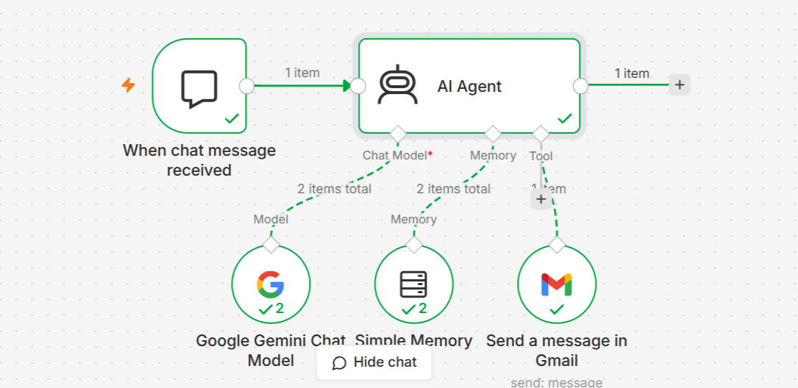
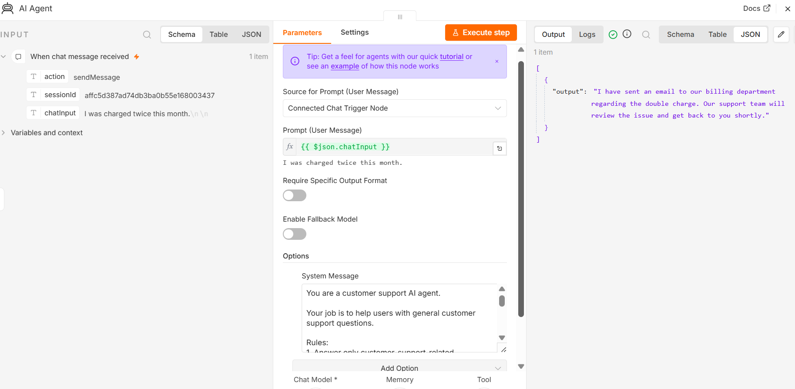
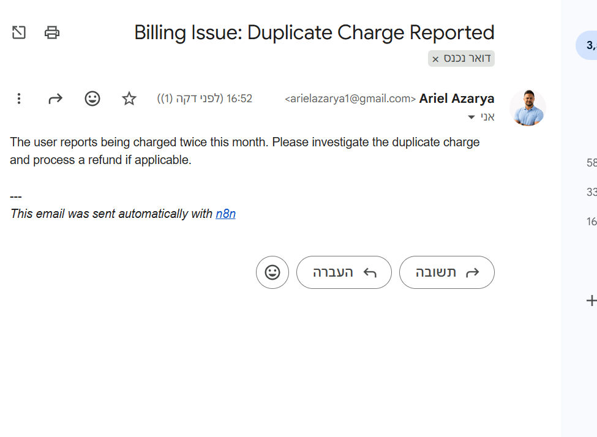

# n8n AI Customer Support Agent

## Workflow Overview

This project demonstrates an AI Customer Support Agent built using n8n and Google Gemini.

### Flow

1. Chat Trigger receives a customer message.
2. AI Agent processes the request using Google Gemini.
3. Customer support questions are answered automatically.
4. Billing, payment, refund, invoice, and subscription issues trigger Gmail notifications.
5. If human assistance is required, the support team is notified.

---

## Workflow Screenshot

---

## AI Agent Configuration

---

## Gmail Notification Proof

